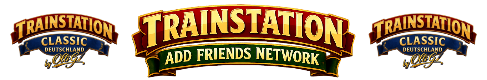

# TrainStation Classic Network



This repository hosts the static website for the **TrainStation Classic Network**, a community-driven platform designed to help players of the "TrainStation Classic" game connect with each other and expand their in-game friends list. The site aims to foster a stronger community by providing a central hub for players to find and add new friends.

## Key Features & Benefits

*   **Friends Network:** A dedicated platform for TrainStation Classic players to find and add new friends.
*   **Community Building:** Facilitates interaction and connection among players, enhancing the overall game experience.
*   **Easy Access:** A simple, static website accessible to anyone with a web browser.
*   **Progressive Web App (PWA) Ready:** Includes `site.webmanifest` and various icons (`favicon.ico`, `favicon.svg`, `apple-touch-icon.png`, `web-app-manifest-192x192.png`, `web-app-manifest-512x512.png`) for an enhanced mobile experience, allowing users to "install" the website to their home screen.

## Project Structure

```
├── README.md
├── apple-touch-icon.png
├── favicon-96x96.png
├── favicon.ico
├── favicon.svg
├── header.jpg
├── index.html
├── site.webmanifest
├── web-app-manifest-192x192.png
├── web-app-manifest-512x512.png
```

## Prerequisites & Dependencies

This project is a static website and does not require any specific server-side prerequisites or dependencies. To view and interact with the site, you only need:

*   A modern web browser (e.g., Chrome, Firefox, Safari, Edge).

## Usage

To use the TrainStation Classic Network:

1.  **Access the Website:** Navigate to `https://olligtrainstationclassic.github.io/` in your web browser.
2.  **Connect with Players:** Follow the instructions on the website to find and add other TrainStation Classic players to your network.

This project does not expose any public APIs

## Acknowledgments

*   Inspired by the "TrainStation Classic" game and its dedicated community.
*   Special thanks to all players who contribute to the network.
